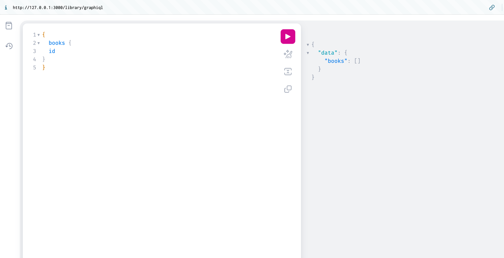

# rails-modular-monolith-example

### Setup
```bash
docker compose up -d --build
```
access to http://127.0.0.1:3000/library/graphiql for library module



### ref
- [Modular Monolith(モジュラーモノリス)についてまとめる](https://r-kaga.com/blog/what-is-modular-monolith)
- [Railsでモジュラモノリスを実現する3つの代表的パターン 5つの基準で見たそれぞれの評価](https://logmi.jp/tech/articles/329825)
- [packs-rails + packwerkでファットモデルを安全に分割する](https://zenn.dev/lincwell_inc/articles/rearchitecture_using_packwerk)
- [packwerkに入門してみた](https://zenn.dev/stmn_inc/articles/67f584ca002d4a)